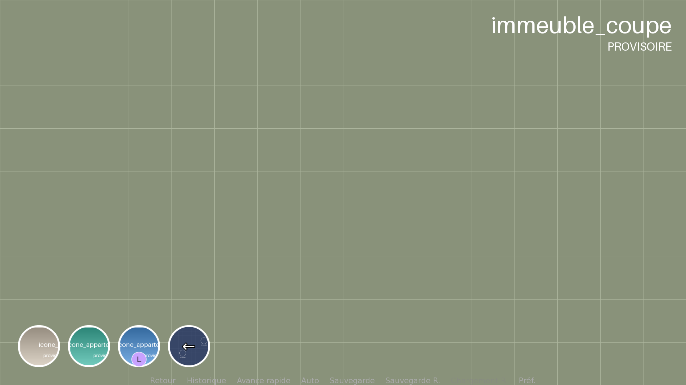
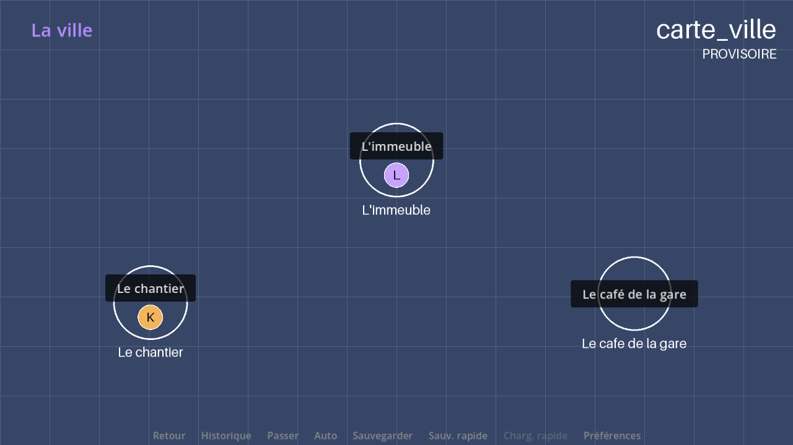

# Bootstrap visual novel : un script, deux moteurs

[English version](README.md)

Un petit jeu de démo écrit **une seule fois** et joué à l'identique par **Ren'Py 8.5** et par un **lecteur Godot 4.7** en GDScript. Il est livré avec la chaîne d'outils pour écrire votre propre jeu.

| Ren'Py | Godot |
|---|---|
|  |  |
|  |  |

## Ce que contient le dépôt

- **Un jeu de démo** : 16 scènes, 2 fins, une vidéo, une galerie débloquable et une journée en liberté (carte de la ville, pièces d'un appartement et de son immeuble, personnages qui se déplacent selon l'heure), jouable en français et en anglais. Il est décrit dans [contenu/](contenu/).
- **Une chaîne d'écriture.** Une bible (personnages, lieux, variables, cartes) et des fiches de scène en YAML deviennent un script `.rpy` commun aux deux moteurs (`tools/fiches.py`). Toutes les routes sont vérifiées avant génération : conditions, variables, routes mortes, choix et lieux jamais proposés.
- **Une navigation.** Une carte extérieure avec des lieux placés sur une image, et à l'intérieur une rangée d'icônes rondes des pièces en bas de l'écran ; sur chaque lieu, les avatars des personnages présents. Une pièce peut être invisible sous condition (une heure, une clé). Les deux moteurs lisent le même `game/navigation.json`.
- **Un lecteur Godot** qui joue ce script avec la même interface que Ren'Py : menu principal, sauvegardes avec vignettes, historique, retour arrière, avance rapide et automatique, préférences, galerie, cartes.
- **Des traductions.** Les fiches sont écrites dans une langue ; chaque traduction a son fichier (`contenu/traductions/en.yaml`), tenu à jour par `traduire`, qui signale les répliques nouvelles ou modifiées. Les deux moteurs lisent les mêmes fichiers de traduction Ren'Py (`game/tl/`), et le joueur choisit la langue dans les préférences.
- **Des tests des deux côtés.** Les parcours sont générés depuis les fiches : Godot et Ren'Py rejouent les mêmes routes et doivent arriver à la même fin.

## Démarrage

Prérequis :
- [Godot 4.7](https://godotengine.org/) ;
- le [SDK Ren'Py 8.5](https://www.renpy.org/latest.html) ;
- Python 3.10 ou plus ;
- `ffmpeg` et `ffmpeg2theora`, pour les vidéos (`brew install ffmpeg ffmpeg2theora` sur macOS).

```sh
python3 -m venv .venv && .venv/bin/pip install -r requirements.txt
godot --path .                          # jouer dans Godot
$RENPY_SDK/renpy.sh .                   # jouer dans Ren'Py ($RENPY_SDK : dossier du SDK)
```

Au premier lancement de Ren'Py, ouvrez le projet depuis le launcher, ou passez son chemin à `renpy.sh`.

**Pour faire votre propre jeu, suivez le [TUTORIEL.md](TUTORIEL.md).**

## Documentation

| Document | Contenu |
|---|---|
| [TUTORIEL.md](TUTORIEL.md) | De la démo à votre jeu, pas à pas |
| [contenu/LISEZMOI.md](contenu/LISEZMOI.md) | Format de la bible et des fiches de scène |
| [SPEC-sous-ensemble-renpy.md](SPEC-sous-ensemble-renpy.md) | Ce que le script commun peut contenir, différences entre moteurs |

## Commandes

```sh
.venv/bin/python tools/fiches.py verifier              # cohérence et toutes les routes
.venv/bin/python tools/fiches.py generer               # écrit le .rpy et les tests de parcours, relu par Godot
.venv/bin/python tools/fiches.py provisoires           # images et vidéos provisoires pour ce qui manque
.venv/bin/python tools/fiches.py production            # images et vidéos à produire
.venv/bin/python tools/fiches.py graphe --ouvrir       # graphe interactif des routes (contenu/graphe.html)
.venv/bin/python tools/fiches.py contexte CH01_SC02    # paquet pour écrire une scène
.venv/bin/python tools/fiches.py traduire en           # met à jour la traduction anglaise
python3 tools/convertir_videos.py                      # .webm → .ogv pour Godot
```

Tests :

```sh
.venv/bin/python -m unittest discover -s tests -p "test_*.py"     # chaîne d'écriture
godot --headless --path . --script res://tests/run_tests.gd        # moteur et routes (Godot)
$RENPY_SDK/renpy.sh . lint                                         # script (Ren'Py)
$RENPY_SDK/renpy.sh . test --overwrite-screenshots                 # routes et galerie (Ren'Py)
```

## Commandes en jeu (Godot, comme dans Ren'Py)

| Touche | Action |
|---|---|
| Clic, Espace, Entrée | continuer |
| Molette vers le haut, Page ↑ | retour arrière |
| Ctrl maintenu, Tab | avance rapide (texte déjà lu) |
| A | avance automatique |
| H | historique |
| Échap, clic droit | menu de jeu |
| F5 / F9 | sauvegarde / chargement rapide |

## Organisation

```
contenu/          bible et fiches de scène : c'est ici qu'on écrit le jeu
  traductions/    un fichier par traduction (en.yaml…)
game/             dossier « game » de Ren'Py, partagé avec Godot
  story/          script .rpy généré depuis contenu/ (ne pas modifier à la main)
  tl/             traductions lues par les deux moteurs : répliques générées (english/story/), interface Ren'Py
  images/, videos/  médias : .webm pour Ren'Py, .ogv pour Godot
  gui/, *.rpy     interface Ren'Py ; Godot en réutilise les images
engine/           lecteur Godot : compilateur, interpréteur, interface
tools/            fiches.py (fiches → .rpy), conversion vidéo, rapport de routes
tests/            tests Godot et Python ; démo figée pour les tests du moteur
```

## Limites

Le script commun est un **sous-ensemble** de Ren'Py : pas d'écrans personnalisés, pas d'ATL, pas de blocs Python. Le détail est dans la [SPEC](SPEC-sous-ensemble-renpy.md). Les médias de la démo sont des images et une vidéo de test.

## Licence

[MIT](LICENSE).

Les fichiers d'interface Ren'Py (`game/gui.rpy`, `game/screens.rpy`, `game/options.rpy` et `game/gui/`) ont été générés par le launcher du SDK Ren'Py, dont l'essentiel est distribué sous licence MIT. Ren'Py et Godot ne sont pas inclus dans ce dépôt.
