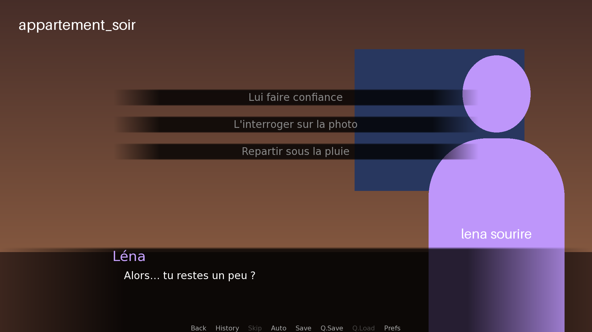

# Visual novel bootstrap: one script, two engines

[Version française](README.fr.md)

A small demo game written **once** and played identically by **Ren'Py 8.5** and by a **Godot 4.7 player** written in GDScript. It comes with the toolchain to write your own game.

| Ren'Py | Godot |
|---|---|
|  |  |

> Every document exists in English and in French. The demo game is written in French and translated into English (Preferences → Language). The tool commands and the scene-sheet keys are in French (`verifier` = check, `generer` = generate, `traduire` = translate, `titre` = title…); the documentation translates them.

## What's inside

- **A demo game**: 7 scenes, 2 endings, a video and an unlockable gallery, playable in French and English. It lives in [contenu/](contenu/).
- **A writing toolchain.** A story bible (characters, locations, variables) and YAML scene sheets are turned into a `.rpy` script shared by both engines (`tools/fiches.py`). Every route is checked before generation: entry conditions, variables, dead ends, choices that are never offered.
- **A Godot player** that runs this script with the same interface as Ren'Py: main menu, saves with thumbnails, history, rollback, skip and auto-forward, preferences, gallery.
- **Translations.** The sheets are written in one language; each translation has its own file (`contenu/traductions/en.yaml`), kept up to date by `traduire`, which flags new and changed lines. Both engines read the same Ren'Py translation files (`game/tl/`), and the player chooses the language in the preferences.
- **Tests on both sides.** Play-through routes are generated from the scene sheets; Godot and Ren'Py replay the same routes and must reach the same ending.

## Getting started

Requirements:
- [Godot 4.7](https://godotengine.org/);
- the [Ren'Py 8.5 SDK](https://www.renpy.org/latest.html);
- Python 3.10 or later;
- `ffmpeg` and `ffmpeg2theora`, for videos (`brew install ffmpeg ffmpeg2theora` on macOS).

```sh
python3 -m venv .venv && .venv/bin/pip install -r requirements.txt
godot --path .                          # play in Godot
$RENPY_SDK/renpy.sh .                   # play in Ren'Py ($RENPY_SDK: the SDK folder)
```

The first time, you can also open the project from the Ren'Py launcher.

**To make your own game, follow the [tutorial](TUTORIAL.md).**

## Documentation

| Document | Contents | Français |
|---|---|---|
| [TUTORIAL.md](TUTORIAL.md) | From the demo to your own game, step by step | [TUTORIEL.md](TUTORIEL.md) |
| [contenu/README.md](contenu/README.md) | Story bible and scene-sheet format | [LISEZMOI.md](contenu/LISEZMOI.md) |
| [SPEC.md](SPEC.md) | What the shared script may contain; differences between the engines | [SPEC-sous-ensemble-renpy.md](SPEC-sous-ensemble-renpy.md) |

## Commands

```sh
.venv/bin/python tools/fiches.py verifier              # check consistency and every route
.venv/bin/python tools/fiches.py generer               # write the .rpy script and route tests, then have Godot re-read it
.venv/bin/python tools/fiches.py provisoires           # placeholder images and videos for anything missing
.venv/bin/python tools/fiches.py production            # list of images and videos to produce
.venv/bin/python tools/fiches.py graphe                # route graph (Mermaid)
.venv/bin/python tools/fiches.py contexte CH01_SC02    # context pack for writing a scene
.venv/bin/python tools/fiches.py traduire en           # update the English translation file
python3 tools/convertir_videos.py                      # .webm → .ogv for Godot
```

Tests:

```sh
.venv/bin/python -m unittest discover -s tests -p "test_*.py"     # writing toolchain
godot --headless --path . --script res://tests/run_tests.gd        # engine and routes (Godot)
$RENPY_SDK/renpy.sh . lint                                         # script (Ren'Py)
$RENPY_SDK/renpy.sh . test --overwrite-screenshots                 # routes and gallery (Ren'Py)
```

## In-game controls (Godot, same as Ren'Py)

| Key | Action |
|---|---|
| Click, Space, Enter | continue |
| Mouse wheel up, Page Up | rollback |
| Hold Ctrl, Tab | skip (already-read text) |
| A | auto-forward |
| H | history |
| Esc, right click | game menu |
| F5 / F9 | quick save / quick load |

## Layout

```
contenu/          story bible and scene sheets: this is where you write the game
  traductions/    one file per translation (en.yaml…)
game/             Ren'Py "game" folder, shared with Godot
  story/          .rpy script generated from contenu/ (do not edit by hand)
  tl/             translations read by both engines: generated lines (english/story/), Ren'Py interface
  images/, videos/  media: .webm for Ren'Py, .ogv for Godot
  gui/, *.rpy     Ren'Py interface; Godot reuses its images
engine/           Godot player: compiler, interpreter, interface
tools/            fiches.py (scene sheets → .rpy), video conversion, route report
tests/            Godot and Python tests; frozen demo for the engine tests
```

## Limitations

The shared script is a **subset** of Ren'Py: no custom screens, no ATL, no Python blocks. See the [spec](SPEC.md) for details. The demo media are test images and a test video.

## License

[MIT](LICENSE).

The Ren'Py interface files (`game/gui.rpy`, `game/screens.rpy`, `game/options.rpy` and `game/gui/`) were generated by the Ren'Py SDK launcher, most of which is MIT-licensed. Neither Ren'Py nor Godot is included in this repository.
