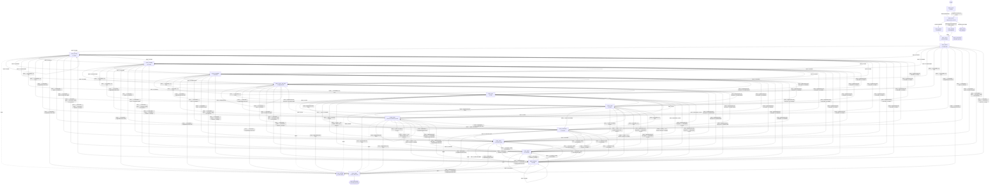

# Graphe des routes

Généré par `tools/fiches.py graphe`. Formes : rectangle = scène, ovale = fin, double cadre = scène appelée ; pointillés = appel ; « carte : … » = lieu choisi sur une carte.

```mermaid
flowchart TD
    DEBUT((début)) --> CH01_SC01
    CH01_SC01["CH01_SC01<br/>L'arrivée"]
    CH01_SC02["CH01_SC02<br/>L'appartement de Léna"]
    CH01_SC03A["CH01_SC03A<br/>La confiance"]
    CH01_SC03B["CH01_SC03B<br/>L'interrogatoire"]
    CH01_SC04["CH01_SC04<br/>Fin de la soirée"]
    CH01_SC05(["CH01_SC05<br/>Fin solitaire"])
    CH01_SOUVENIR[["CH01_SOUVENIR<br/>Souvenir du père"]]
    CH02_CAFE["CH02_CAFE<br/>Le café de la gare"]
    CH02_CANNES["CH02_CANNES<br/>La plage"]
    CH02_CAVE["CH02_CAVE<br/>La cave"]
    CH02_CHAMBRE["CH02_CHAMBRE<br/>La chambre"]
    CH02_CHANTIER["CH02_CHANTIER<br/>Le chantier"]
    CH02_CUISINE["CH02_CUISINE<br/>La cuisine"]
    CH02_EPILOGUE(["CH02_EPILOGUE<br/>Trois mois plus tard"])
    CH02_HALL["CH02_HALL<br/>Le hall"]
    CH02_HEURE[["CH02_HEURE<br/>L'heure tourne"]]
    CH02_LENA["CH02_LENA<br/>Chez Léna, dans la journée"]
    CH02_MATIN["CH02_MATIN<br/>Le lendemain"]
    CH02_PARIS["CH02_PARIS<br/>Les archives"]
    CH02_SALLE_DE_BAIN["CH02_SALLE_DE_BAIN<br/>La salle de bain"]
    CH02_SALON["CH02_SALON<br/>Le salon"]
    CH02_SOIR["CH02_SOIR<br/>Le soir, chez Léna"]
    CH01_SC01 -->|"Monter directement"| CH01_SC02
    CH01_SC01 -->|"Regarder la boîte aux lettres"| CH01_SC02
    CH01_SC02 -->|"Lui faire confiance"| CH01_SC03A
    CH01_SC02 -->|"L'interroger sur la photo (si indice_photo)"| CH01_SC03B
    CH01_SC02 -->|"Repartir sous la pluie"| CH01_SC05
    CH01_SC03A --> CH01_SC04
    CH01_SC03B -.->|appel| CH01_SOUVENIR
    CH01_SC03B --> CH01_SC04
    CH01_SC04 --> CH02_MATIN
    CH02_CAFE -.->|appel| CH02_HEURE
    CH02_CAFE -->|"carte : Le chantier"| CH02_CHANTIER
    CH02_CAFE -->|"carte : Le café de la gare"| CH02_CAFE
    CH02_CAFE -->|"carte : L'immeuble › Le hall"| CH02_HALL
    CH02_CAFE -->|"carte : L'immeuble › La cave"| CH02_CAVE
    CH02_CAFE -->|"carte : L'immeuble › L'appartement de Léna"| CH02_LENA
    CH02_CAFE -->|"carte : L'immeuble › L'appartement de Léna"| CH02_SOIR
    CH02_CAFE -->|"carte : L'appartement de mon père › Le salon"| CH02_SALON
    CH02_CAFE -->|"carte : L'appartement de mon père › La cuisine"| CH02_CUISINE
    CH02_CAFE -->|"carte : L'appartement de mon père › La chambre"| CH02_CHAMBRE
    CH02_CAFE -->|"carte : L'appartement de mon père › La salle de bain"| CH02_SALLE_DE_BAIN
    CH02_CAFE -->|"carte : ← La France › Paris › Les archives"| CH02_PARIS
    CH02_CAFE -->|"carte : ← La France › Cannes › La plage"| CH02_CANNES
    CH02_CANNES -.->|appel| CH02_HEURE
    CH02_CANNES -->|"carte : La plage"| CH02_CANNES
    CH02_CANNES -->|"carte : L'appartement de mon père › Le salon"| CH02_SALON
    CH02_CANNES -->|"carte : L'appartement de mon père › La cuisine"| CH02_CUISINE
    CH02_CANNES -->|"carte : L'appartement de mon père › La chambre"| CH02_CHAMBRE
    CH02_CANNES -->|"carte : L'appartement de mon père › La salle de bain"| CH02_SALLE_DE_BAIN
    CH02_CANNES -->|"carte : L'appartement de mon père › ← L'immeuble › Le hall"| CH02_HALL
    CH02_CANNES -->|"carte : L'appartement de mon père › ← L'immeuble › La cave"| CH02_CAVE
    CH02_CANNES -->|"carte : L'appartement de mon père › ← L'immeuble › L'appartement de Léna"| CH02_LENA
    CH02_CANNES -->|"carte : L'appartement de mon père › ← L'immeuble › L'appartement de Léna"| CH02_SOIR
    CH02_CANNES -->|"carte : ← La France › Lyon › Le chantier"| CH02_CHANTIER
    CH02_CANNES -->|"carte : ← La France › Lyon › Le café de la gare"| CH02_CAFE
    CH02_CANNES -->|"carte : ← La France › Paris › Les archives"| CH02_PARIS
    CH02_CAVE -.->|appel| CH02_HEURE
    CH02_CAVE -->|"carte : Le hall"| CH02_HALL
    CH02_CAVE -->|"carte : La cave"| CH02_CAVE
    CH02_CAVE -->|"carte : L'appartement de Léna"| CH02_LENA
    CH02_CAVE -->|"carte : L'appartement de Léna"| CH02_SOIR
    CH02_CAVE -->|"carte : L'appartement de mon père › Le salon"| CH02_SALON
    CH02_CAVE -->|"carte : L'appartement de mon père › La cuisine"| CH02_CUISINE
    CH02_CAVE -->|"carte : L'appartement de mon père › La chambre"| CH02_CHAMBRE
    CH02_CAVE -->|"carte : L'appartement de mon père › La salle de bain"| CH02_SALLE_DE_BAIN
    CH02_CAVE -->|"carte : ← Lyon › Le chantier"| CH02_CHANTIER
    CH02_CAVE -->|"carte : ← Lyon › Le café de la gare"| CH02_CAFE
    CH02_CAVE -->|"carte : ← Lyon › ← La France › Paris › Les archives"| CH02_PARIS
    CH02_CAVE -->|"carte : ← Lyon › ← La France › Cannes › La plage"| CH02_CANNES
    CH02_CHAMBRE -->|"carte : Le salon"| CH02_SALON
    CH02_CHAMBRE -->|"carte : La cuisine"| CH02_CUISINE
    CH02_CHAMBRE -->|"carte : La chambre"| CH02_CHAMBRE
    CH02_CHAMBRE -->|"carte : La salle de bain"| CH02_SALLE_DE_BAIN
    CH02_CHAMBRE -->|"carte : ← L'immeuble › Le hall"| CH02_HALL
    CH02_CHAMBRE -->|"carte : ← L'immeuble › La cave"| CH02_CAVE
    CH02_CHAMBRE -->|"carte : ← L'immeuble › L'appartement de Léna"| CH02_LENA
    CH02_CHAMBRE -->|"carte : ← L'immeuble › L'appartement de Léna"| CH02_SOIR
    CH02_CHAMBRE -->|"carte : ← L'immeuble › ← Lyon › Le chantier"| CH02_CHANTIER
    CH02_CHAMBRE -->|"carte : ← L'immeuble › ← Lyon › Le café de la gare"| CH02_CAFE
    CH02_CHAMBRE -->|"carte : ← L'immeuble › ← Lyon › ← La France › Paris › Les archives"| CH02_PARIS
    CH02_CHAMBRE -->|"carte : ← L'immeuble › ← Lyon › ← La France › Cannes › La plage"| CH02_CANNES
    CH02_CHANTIER -.->|appel| CH02_HEURE
    CH02_CHANTIER -->|"carte : Le chantier"| CH02_CHANTIER
    CH02_CHANTIER -->|"carte : Le café de la gare"| CH02_CAFE
    CH02_CHANTIER -->|"carte : L'immeuble › Le hall"| CH02_HALL
    CH02_CHANTIER -->|"carte : L'immeuble › La cave"| CH02_CAVE
    CH02_CHANTIER -->|"carte : L'immeuble › L'appartement de Léna"| CH02_LENA
    CH02_CHANTIER -->|"carte : L'immeuble › L'appartement de Léna"| CH02_SOIR
    CH02_CHANTIER -->|"carte : L'appartement de mon père › Le salon"| CH02_SALON
    CH02_CHANTIER -->|"carte : L'appartement de mon père › La cuisine"| CH02_CUISINE
    CH02_CHANTIER -->|"carte : L'appartement de mon père › La chambre"| CH02_CHAMBRE
    CH02_CHANTIER -->|"carte : L'appartement de mon père › La salle de bain"| CH02_SALLE_DE_BAIN
    CH02_CHANTIER -->|"carte : ← La France › Paris › Les archives"| CH02_PARIS
    CH02_CHANTIER -->|"carte : ← La France › Cannes › La plage"| CH02_CANNES
    CH02_CUISINE -->|"carte : Le salon"| CH02_SALON
    CH02_CUISINE -->|"carte : La cuisine"| CH02_CUISINE
    CH02_CUISINE -->|"carte : La chambre"| CH02_CHAMBRE
    CH02_CUISINE -->|"carte : La salle de bain"| CH02_SALLE_DE_BAIN
    CH02_CUISINE -->|"carte : ← L'immeuble › Le hall"| CH02_HALL
    CH02_CUISINE -->|"carte : ← L'immeuble › La cave"| CH02_CAVE
    CH02_CUISINE -->|"carte : ← L'immeuble › L'appartement de Léna"| CH02_LENA
    CH02_CUISINE -->|"carte : ← L'immeuble › L'appartement de Léna"| CH02_SOIR
    CH02_CUISINE -->|"carte : ← L'immeuble › ← Lyon › Le chantier"| CH02_CHANTIER
    CH02_CUISINE -->|"carte : ← L'immeuble › ← Lyon › Le café de la gare"| CH02_CAFE
    CH02_CUISINE -->|"carte : ← L'immeuble › ← Lyon › ← La France › Paris › Les archives"| CH02_PARIS
    CH02_CUISINE -->|"carte : ← L'immeuble › ← Lyon › ← La France › Cannes › La plage"| CH02_CANNES
    CH02_HALL -.->|appel| CH02_HEURE
    CH02_HALL -->|"carte : Le hall"| CH02_HALL
    CH02_HALL -->|"carte : La cave"| CH02_CAVE
    CH02_HALL -->|"carte : L'appartement de Léna"| CH02_LENA
    CH02_HALL -->|"carte : L'appartement de Léna"| CH02_SOIR
    CH02_HALL -->|"carte : L'appartement de mon père › Le salon"| CH02_SALON
    CH02_HALL -->|"carte : L'appartement de mon père › La cuisine"| CH02_CUISINE
    CH02_HALL -->|"carte : L'appartement de mon père › La chambre"| CH02_CHAMBRE
    CH02_HALL -->|"carte : L'appartement de mon père › La salle de bain"| CH02_SALLE_DE_BAIN
    CH02_HALL -->|"carte : ← Lyon › Le chantier"| CH02_CHANTIER
    CH02_HALL -->|"carte : ← Lyon › Le café de la gare"| CH02_CAFE
    CH02_HALL -->|"carte : ← Lyon › ← La France › Paris › Les archives"| CH02_PARIS
    CH02_HALL -->|"carte : ← Lyon › ← La France › Cannes › La plage"| CH02_CANNES
    CH02_LENA -.->|appel| CH02_HEURE
    CH02_LENA -->|"carte : Le hall"| CH02_HALL
    CH02_LENA -->|"carte : La cave"| CH02_CAVE
    CH02_LENA -->|"carte : L'appartement de Léna"| CH02_LENA
    CH02_LENA -->|"carte : L'appartement de Léna"| CH02_SOIR
    CH02_LENA -->|"carte : L'appartement de mon père › Le salon"| CH02_SALON
    CH02_LENA -->|"carte : L'appartement de mon père › La cuisine"| CH02_CUISINE
    CH02_LENA -->|"carte : L'appartement de mon père › La chambre"| CH02_CHAMBRE
    CH02_LENA -->|"carte : L'appartement de mon père › La salle de bain"| CH02_SALLE_DE_BAIN
    CH02_LENA -->|"carte : ← Lyon › Le chantier"| CH02_CHANTIER
    CH02_LENA -->|"carte : ← Lyon › Le café de la gare"| CH02_CAFE
    CH02_LENA -->|"carte : ← Lyon › ← La France › Paris › Les archives"| CH02_PARIS
    CH02_LENA -->|"carte : ← Lyon › ← La France › Cannes › La plage"| CH02_CANNES
    CH02_MATIN -->|"carte : Le salon"| CH02_SALON
    CH02_MATIN -->|"carte : La cuisine"| CH02_CUISINE
    CH02_MATIN -->|"carte : La chambre"| CH02_CHAMBRE
    CH02_MATIN -->|"carte : La salle de bain"| CH02_SALLE_DE_BAIN
    CH02_MATIN -->|"carte : ← L'immeuble › Le hall"| CH02_HALL
    CH02_MATIN -->|"carte : ← L'immeuble › La cave"| CH02_CAVE
    CH02_MATIN -->|"carte : ← L'immeuble › L'appartement de Léna"| CH02_LENA
    CH02_MATIN -->|"carte : ← L'immeuble › L'appartement de Léna"| CH02_SOIR
    CH02_MATIN -->|"carte : ← L'immeuble › ← Lyon › Le chantier"| CH02_CHANTIER
    CH02_MATIN -->|"carte : ← L'immeuble › ← Lyon › Le café de la gare"| CH02_CAFE
    CH02_MATIN -->|"carte : ← L'immeuble › ← Lyon › ← La France › Paris › Les archives"| CH02_PARIS
    CH02_MATIN -->|"carte : ← L'immeuble › ← Lyon › ← La France › Cannes › La plage"| CH02_CANNES
    CH02_PARIS -.->|appel| CH02_HEURE
    CH02_PARIS -->|"carte : Les archives"| CH02_PARIS
    CH02_PARIS -->|"carte : L'appartement de mon père › Le salon"| CH02_SALON
    CH02_PARIS -->|"carte : L'appartement de mon père › La cuisine"| CH02_CUISINE
    CH02_PARIS -->|"carte : L'appartement de mon père › La chambre"| CH02_CHAMBRE
    CH02_PARIS -->|"carte : L'appartement de mon père › La salle de bain"| CH02_SALLE_DE_BAIN
    CH02_PARIS -->|"carte : L'appartement de mon père › ← L'immeuble › Le hall"| CH02_HALL
    CH02_PARIS -->|"carte : L'appartement de mon père › ← L'immeuble › La cave"| CH02_CAVE
    CH02_PARIS -->|"carte : L'appartement de mon père › ← L'immeuble › L'appartement de Léna"| CH02_LENA
    CH02_PARIS -->|"carte : L'appartement de mon père › ← L'immeuble › L'appartement de Léna"| CH02_SOIR
    CH02_PARIS -->|"carte : ← La France › Lyon › Le chantier"| CH02_CHANTIER
    CH02_PARIS -->|"carte : ← La France › Lyon › Le café de la gare"| CH02_CAFE
    CH02_PARIS -->|"carte : ← La France › Cannes › La plage"| CH02_CANNES
    CH02_SALLE_DE_BAIN -->|"carte : Le salon"| CH02_SALON
    CH02_SALLE_DE_BAIN -->|"carte : La cuisine"| CH02_CUISINE
    CH02_SALLE_DE_BAIN -->|"carte : La chambre"| CH02_CHAMBRE
    CH02_SALLE_DE_BAIN -->|"carte : La salle de bain"| CH02_SALLE_DE_BAIN
    CH02_SALLE_DE_BAIN -->|"carte : ← L'immeuble › Le hall"| CH02_HALL
    CH02_SALLE_DE_BAIN -->|"carte : ← L'immeuble › La cave"| CH02_CAVE
    CH02_SALLE_DE_BAIN -->|"carte : ← L'immeuble › L'appartement de Léna"| CH02_LENA
    CH02_SALLE_DE_BAIN -->|"carte : ← L'immeuble › L'appartement de Léna"| CH02_SOIR
    CH02_SALLE_DE_BAIN -->|"carte : ← L'immeuble › ← Lyon › Le chantier"| CH02_CHANTIER
    CH02_SALLE_DE_BAIN -->|"carte : ← L'immeuble › ← Lyon › Le café de la gare"| CH02_CAFE
    CH02_SALLE_DE_BAIN -->|"carte : ← L'immeuble › ← Lyon › ← La France › Paris › Les archives"| CH02_PARIS
    CH02_SALLE_DE_BAIN -->|"carte : ← L'immeuble › ← Lyon › ← La France › Cannes › La plage"| CH02_CANNES
    CH02_SALON -.->|appel| CH02_HEURE
    CH02_SALON -->|"carte : Le salon"| CH02_SALON
    CH02_SALON -->|"carte : La cuisine"| CH02_CUISINE
    CH02_SALON -->|"carte : La chambre"| CH02_CHAMBRE
    CH02_SALON -->|"carte : La salle de bain"| CH02_SALLE_DE_BAIN
    CH02_SALON -->|"carte : ← L'immeuble › Le hall"| CH02_HALL
    CH02_SALON -->|"carte : ← L'immeuble › La cave"| CH02_CAVE
    CH02_SALON -->|"carte : ← L'immeuble › L'appartement de Léna"| CH02_LENA
    CH02_SALON -->|"carte : ← L'immeuble › L'appartement de Léna"| CH02_SOIR
    CH02_SALON -->|"carte : ← L'immeuble › ← Lyon › Le chantier"| CH02_CHANTIER
    CH02_SALON -->|"carte : ← L'immeuble › ← Lyon › Le café de la gare"| CH02_CAFE
    CH02_SALON -->|"carte : ← L'immeuble › ← Lyon › ← La France › Paris › Les archives"| CH02_PARIS
    CH02_SALON -->|"carte : ← L'immeuble › ← Lyon › ← La France › Cannes › La plage"| CH02_CANNES
    CH02_SOIR --> CH02_EPILOGUE
```
